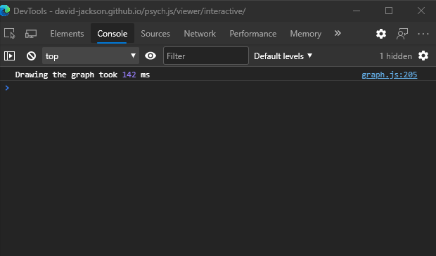
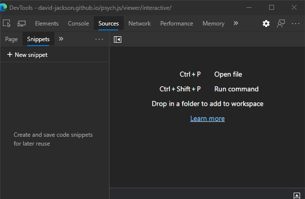

# Getting Started

psych.js is a Javascript library build for all sort of psychrometric calculations. Built on top of psych.js is a psychrometric chart viewer that enables you to visualize those calculations, and as a result, the Air Processes, and Air Units that can be used to size HVAC and Air Handling equipment.

## Accessing the Psychrometric Chart

The psychrometric chart can be accessed [here](https://david-jackson.github.io/psych.js/viewer/interactive/). After loading that page, you should be looking at something similar to this:


Here you can move your mouse around the screen and see that the card in the top left updates with the psychrometric properties at the cursor location. 


## Accessing the Console

To add objects to the chart, process calculations, and access data, Javascript code needs to be used to access the psych.js library. psych.js can be accessed through any Javascript file, or through the console in your browser. All browsers are different, but in general the console can be accessed by pressing `F12` to access Dev Tools while the web page is open, or by right clicking on the page and selecting `Inspect` and then selecting `Console`.



From the console, you can access, change, and process calculations through psych.js and the graph. Here is an example of changing the elevation of the graph:
```
graph.properties.elevation = 100; // changes the graph elevation to 100 feet

redraw(); // redraws the graph with the updated properties
```

After executing the `redraw()` command, you can see the graph update.

## Executing code through Code Snippets

Often times we want to execute several commands at once, or save our code so that it can be accessed later. This can be done through Code Snippets in the Google Chrome and Microsoft Edge browser. To access Code Snippets, select the `Sources` tab in Dev Tools, then select the double arrows (`>>`) and choose `Snippets`. This opens an area where you can create, save, and edit multiple snippets and the execute that code on the current page.



To execute the code after writing and saving the snippet, simply press the play button at the bottom of the snippet, or by using the `Ctrl+Enter` key combination while the snippet is active.


## Basic Commands

Here are some basic commands that are helpful when using psych.js and the Psychrometric Chart Viewer. Please note that after changing any of the graphs parameters, adding points or AirUnits, `redraw()` needs to be called at the end of your code to update the graph with all of the changes. 

### Changing the Graph's Elevation

Elevation is essential in determining the density of air at any point, so it is a good idea to define a variable that can be used multiple times to reference whatever elevation you are working with, like this:

```
var ELEV = 250; // this creates a variable named 'ELEV' that is set to 250 (in this case meaning 250 feet)
```

With this variable defined, we can then use it to change the elevation of the graph:

```
graph.properties.elevation = ELEV;
```

To make this command take effect on our chart, we have to call the `redraw()` command. Putting this all together, our code snippet will look something like this:

```
var ELEV = 250;

graph.properties.elevation = ELEV;

redraw();
```

### Creating Points

Now that we have a chart with the correct elevation on it, we can start creating points to add to the chart. The easiest way to generate psychrometric points is using the `psych.PointBuilder` method. The `PointBuilder` requires three parameters; Elevation, and then any combination of two of the following:

- Dry Bulb Temperature (`db`)
- Wet Bulb Temperature (`wb`)
- Relative Humidity (`rh`)
- Humidity Ratio (`W`)
- Enthalpy (`h`)

Calling `.build()` at the end of your `PointBuilder` will calculate all of the other properties per the given conditions, which you can access later by calling `pt.properties.{variableName}`

```
var pt = new psych.PointBuilder()
    .withElevation(ELEV)
    .withDryBulb(75)
    .withRelativeHumidity(60)
    .build();
```

### A Quick Note on Styles

When you add points, lines, or shapes to the chart/graph, you have to define how you want that object to look. When adding objects to the graph, the first variable these add functions take is a style variable. Luckily this can be left blank (`{}`) for the default red style, or there are some other  default colors that can easily be used for points and lines:

- Default Point Colors:
  - `graph.colors.points.grey`
  - `graph.colors.points.green`
  - `graph.colors.points.red` (default, so you can leave it blank `{}`)
- Default Line Colors:
  - `graph.colors.lines.grey`
  - `graph.colors.lines.red`
  - `graph.colors.lines.green`
  - `graph.colors.lines.blue`
  - `graph.colors.lines.orange`

If needed, you can control the stroke color, fill color, and line thickness of these objects by creating an object in the first variable. Here is what the style object would like if you wanted a green point with a radius of 20px:

```
{
    stroke: color(0, 255, 0),
    fill: color(0, 255, 0),
    radius: 20
}
```

Here is what the style object would like if we wanted a green line with a line weight of 5px:

```
{
    stroke: color(0, 255, 0),
    weight: 5
    radius: null,
    fill: null
}
```

### Adding Points to the Graph

Adding points to the graph can be done calling the `graph.addPoints` method. Remember to call `redraw()` to have your changes take effect.

```
var pt = new psych.PointBuilder()
    .withElevation(ELEV)
    .withDryBulb(75)
    .withRelativeHumidity(60)
    .build();

graph.addPoints({}, pt); // default style

redraw();
```

You can also add multiple points in the same method by just adding more points:

```
var pt1 = new psych.PointBuilder()
    .withElevation(ELEV)
    .withDryBulb(75)
    .withRelativeHumidity(60)
    .build();

var pt2 = new psych.PointBuilder()
    .withElevation(ELEV)
    .withDryBulb(60)
    .withRelativeHumidity(40)
    .build();

graph.addPoints(graph.colors.points.grey, pt1, pt2); // grey point style

redraw();
```

### Adding Lines to the Graph

Adding a line to the graph can be done calling the `graph.addLine` method. This method takes a style, and an array of at least two points.

```
var pt1 = new psych.PointBuilder()
    .withElevation(ELEV)
    .withDryBulb(75)
    .withRelativeHumidity(60)
    .build();

var pt2 = new psych.PointBuilder()
    .withElevation(ELEV)
    .withDryBulb(60)
    .withRelativeHumidity(40)
    .build();

graph.addLine(graph.colors.lines.grey, [pt1, pt2]);

redraw();
```

### Creating Lines of Constant Relative Humidity 

Often, it is helpful to show a line that has a constant relative humidity. For that, you can use the `graph.lineOfConstantRelativeHumidity` or `graph.addLineOfConstantRelativeHumidity` function.

The `graph.lineOfConstantRelativeHumidity` function takes two points and returns an array of points that are between those two values. This is useful when making a shape that has a line of constant relative humidity.

The `graph.addLineOfConstantRelativeHumidity` function takes a line style and two points to add a line of constant relative humidity directly to the graph.

```
var pt1 = new psych.PointBuilder()
    .withElevation(ELEV)
    .withDryBulb(75)
    .withRelativeHumidity(60)
    .build();

var pt2 = new psych.PointBuilder()
    .withElevation(ELEV)
    .withDryBulb(40)
    .withRelativeHumidity(60)
    .build();

graph.addLineOfConstantRelativeHumidity(graph.colors.lines.grey, pt1, pt2);

redraw();
```

### Adding Shapes to the Graph

Adding a closed shape to the graph can be done calling the `graph.addShape` method. This method takes a style, and an array of at least two points.

```
var pt1 = new psych.PointBuilder()
    .withElevation(ELEV)
    .withDryBulb(75)
    .withRelativeHumidity(60)
    .build();

var pt2 = new psych.PointBuilder()
    .withElevation(ELEV)
    .withDryBulb(60)
    .withRelativeHumidity(40)
    .build();

var pt3 = new psych.PointBuilder()
    .withElevation(ELEV)
    .withDryBulb(50)
    .withRelativeHumidity(90)
    .build();

graph.addLine({}, [pt1, pt2, pt3]);

redraw();
```

### Creating an AirProcess

An `AirProcess` is any process that effects air in some way, like a Cooling Coil, Burner, Humidifier, or even a Fan. Every `AirProcess` takes an inlet condition, desired outlet condition, a volume (in cfm), and optionally a list of downstream `AirProcess`es, and calculates an actual outlet condition, as well as the utility loads to take the air from the inlet to the actual outlet condition. Here are a list of currently implemented `AirProcess`es:

- `Burner`
- `CoolingCoil`
- `Humidifier`
- `Fan`

Each `AirProcess` has a `.calculate()` and a `.draw()` method that will calculate the loads and actual outlet condition, and draw the process on the graph, respectively. Loads can be found under the `.loads` object of the `AirProcess`.

```
var inlet = new psych.PointBuilder()
    .withElevation(ELEV)
    .withDryBulb(90)
    .withRelativeHumidity(60)
    .build();

var setpoint = new psych.PointBuilder()
    .withElevation(ELEV)
    .withDryBulb(75)
    .withRelativeHumidity(50)
    .build();

var coil = new CoolingCoil(inlet, setpoint, 10000);
coil.calculate();
coil.draw();

redraw();
```


### Creating an AirUnit

An `AirUnit` is a way of representing a ASU or RAU. It is essentially made up of a group of `AirProcess`es, where the actual outlet condition of one `AirProcess` feeds into the inlet condition of the next. The `AirUnit` method takes an array of inlets, array of outlets, an air volume (in cfm), and an array of `AirProcess`es. Each `AirUnit` has a `.calculate()` and a `.draw()` method that will calculate the loads, and draw the entire process on the graph. The `AirUnit` can take multiple inlet and outlet conditions for when you have multiple different conditions for the same unit, i.e. for summer and winter.


```
var summerInlet = new psych.PointBuilder()
    .withElevation(ELEV)
    .withDryBulb(90)
    .withRelativeHumidity(60)
    .build();

var winterInlet = new psych.PointBuilder()
    .withElevation(ELEV)
    .withDryBulb(10)
    .withRelativeHumidity(30)
    .build();

var setpoint = new psych.PointBuilder()
    .withElevation(ELEV)
    .withDryBulb(75)
    .withRelativeHumidity(50)
    .build();

var boothASU = new AirUnit([summerInlet, winterInlet], [setpoint], 50000, [Burner, CoolingCoil, Humidifier, Burner, Fan]);
boothASU.calculate();
boothASU.draw();

redraw();
```