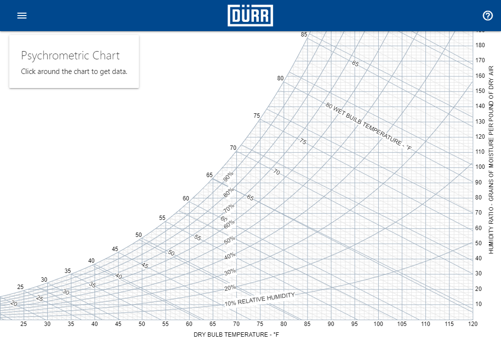
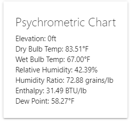

# Getting Started

psych.js is a Javascript library build for all sort of psychrometric calculations. Built on top of psych.js is a psychrometric chart viewer that enables you to visualize those calculations, and as a result, the Air Processes, and Air Units that can be used to size HVAC and Air Handling equipment.

## Accessing the Psychrometric Chart

The psychrometric chart can be accessed [Here](https://david-jackson.github.io/psych.js/viewer/interactive/). After loading that page, you should be looking at something similar to this:

Here you can move your mouse around the screen and see that the card in the top left updates with the psychrometric properties at the cursor location. 

## Accessing the Console

To add objects to the chart, process calculations, and access data, Javascript code needs to be used to access the psych.js library. psych.js can be accessed through any Javascript file, or through the console in your browser. All browsers are different, but in general the console can be accessed by pressing `F11` while the web page is open, or by right clicking on the page and selecting `Inspect` and then selecting `Console`.

